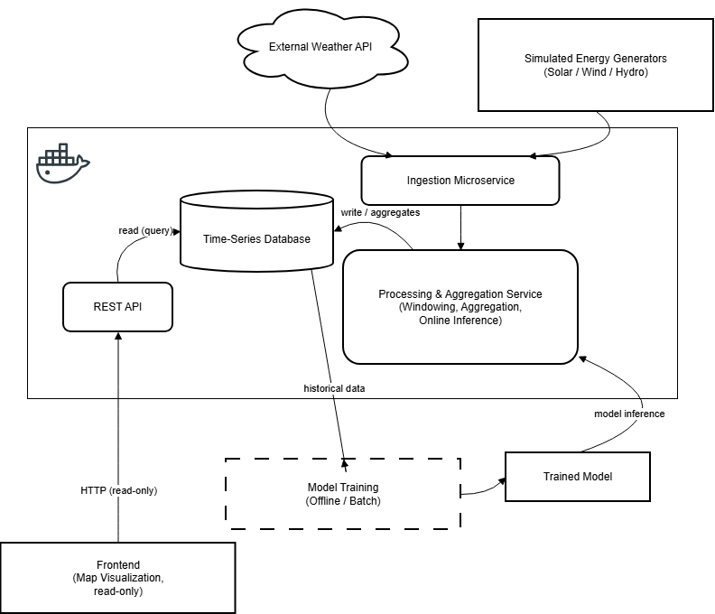
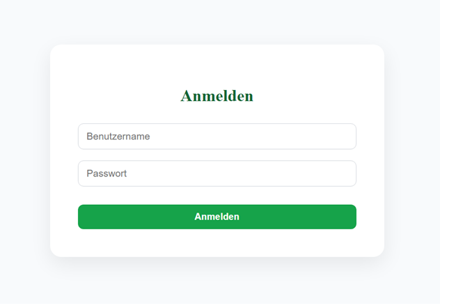
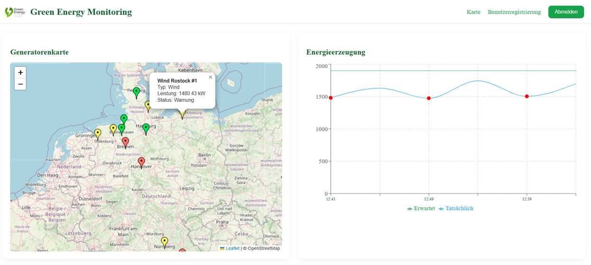
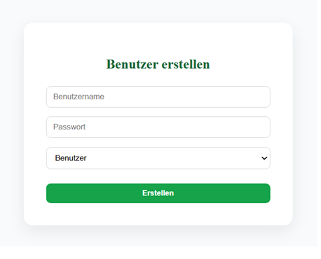

# Green Energy Real-Time Data Platform

A scalable microservice-based backend platform for processing and reporting renewable energy time-series data.

The system is designed with a strong focus on:

reliability

scalability

maintainability

reproducibility

clear separation of concerns

It processes weather-driven renewable energy generation (solar, wind, hydro) and machine learning predictions on datasets exceeding 1M+ time-stamped records.

## Key Features

Simulation of renewable energy production using real weather data

Near real-time data processing & aggregation

ML-powered power output prediction

Time-series storage & historical analytics

Map-based visualization & reporting

Re-trainable ML pipeline

## Architecture

The backend follows a Dockerized microservice architecture.

containerized real-time inference services

offline ML training pipeline

internal service communication via Docker network

This structure mirrors real-world MLOps and data platform design patterns.

### Authorization

### Map Visualization

### Adminpanel

## System Components

### 1️ Generator & Ingestion Service (Java, Spring Boot)

Port: 8082

simulates energy production

integrates weather features

generates historical datasets

calls ML inference API

runs on scheduled intervals

### 2️ Backend Service (Java, Spring Boot)

Port: 8081

stores & aggregates data

exposes REST endpoints

central reporting layer

### 3️ Time-Series Storage (PostgreSQL)

Port: 5432

raw & aggregated data storage

persistent via Docker volumes

### 4️ Machine Learning Module (Python)

Online Inference API (Docker, Port 8000)

serves predictions via REST

loads serialized model

provides status endpoint

Offline Training Pipeline (local batch process)

builds training dataset

retrains model daily

updates model.pkl

This separation ensures uninterrupted inference and flexible experimentation.

### 5️ Frontend (React / Vue)

Run locally:

npm start

map-based visualization

demo authentication

read-only reporting interface

Frontend is intentionally not containerized to simplify development.

Running the Platform

From the project root:

docker compose up --build

This starts:

PostgreSQL

Backend

Generator

ML Inference API

Stop services:

docker compose down

Remove volumes:

docker compose down -v

### Local Endpoints

Service URL
Backend API http://localhost:8081

Generator http://localhost:8082

ML API http://localhost:8000

## Environment Configuration

Configured via Docker Compose:

SPRING_DATASOURCE_URL

SPRING_DATASOURCE_USERNAME

SPRING_DATASOURCE_PASSWORD

INTERSERVICE_ML_BASE_URL

Docker internal hostnames:

postgres

ml-api

Design Principles

microservice separation

containerized backend infrastructure

internal service discovery via Docker DNS

offline + online ML workflow separation

batch vs real-time workload isolation

reproducible local environment
